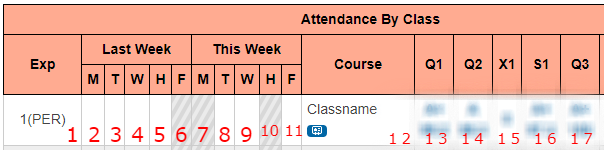

[

](PowerTool.jpg)

<h1 align="center">PowerTool</h1>

PowerTool retrieves class and grade data from PowerSchool. Among other features, PowerTool retrieves class and grade data and displays it on a minimalistic GUI. After this project reaches 1.0.0, I will have release section on Github and a download link provided. This project was created for learning web scraping among other programming things and I am providing the source code as others may be able to debug similar projects with it.

 

### Patch Notes for 1.1.0:

- Compatibility Patch. Guide below.
- Major bug fixes. Including one which made it impossible to make the program run properly for most users.
- You will have to change a file manually-- previous versions didn't allow for this causing almost every user of the program to have some sort of error. Instructions can be found down below.

 

### Patch Notes for 1.0.0:

- Main project goal complete!
- Fixed grade difference statement. It now displays the difference of your current grades and prior grades of when you clicked run. (It also saves the grade data in a file when the run button has been pressed twice previously so you can get the grade difference when you open PowerTool later!)
- Licensed under MIT License.
- Resolved quarter bugs.
- Improved performance.

 

### Patch Notes for 0.9.0:

- Main project goal almost complete.
- Created GUI for PowerTool.
- Created the class-grade statement that appears on run.
- Grade difference feature WIP...

## Setup Guide:

Firstly, install as you would another program-- but make sure you check "create desktop shortcut" in setup.

 After you are finished with the setup file, a shortcut for PowerTool will appear on your desktop. Right click it, and press "open file location". Once you have done that, find Variables.txt and open it.

 Here you should replace the sample link on the second line of the file to your PowerSchool login page link. DO NOT remove the two ' characters at the start and end of the link. Make sure to save the file when finished.

 Now, let's configure the first line. The numbers in quotes are what you enter in the "quarter" section of the GUI to get the grades of the corresponding column... I'll explain this. Go to PowerSchool and number the columns you have similar to how I have done it below.

 So for me, quarter one has a column number of 13 as shown in the picture. I enter "1" in PowerTool to get the grades from that column. This is similar for other quarters. I enter "3" in PowerTool to get the grades from column number 17.

 I hope you all have a use for my project!
  